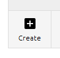

# Introduction to Text-Mining with Python

## Introduction

This repository contains Jupyter notebooks used for teaching *'Introduction to Text-Mining with Python'*, 
a course in the [Cambridge 
Digital Humanities](https://www.cdh.cam.ac.uk) (CDH) Learning programme (from 2020 onwards).

The notebooks are designed to be worked on as self-paced materials in a 'flipped classroom' approach. They 
are also written as stand-alone notebooks for anyone to follow and use as they wish.

The aim is to teach the basic concepts of a text-mining workflow to a wide audience. The level of Python and 
text-mining is aimed at beginners. As such, the notebooks are designed to be run as a teaching aid, not as a 
serious text analysis tool.

### Content

The notebooks cover:

* Basic Python (strings, lists, list comprehensions, imports, functions, opening/reading/saving files)
* Steps in a text-mining pipeline for research
* Basic text-mining concepts (tokenising, normalising, cleaning, stopwords)
* Creating a frequency distribution and plotting the results

### License

The code is released under an [MIT License](LICENSE). The text is licensed under Creative Commons 
[CC BY 4.0](https://creativecommons.org/licenses/by/4.0/).

## Quick Start: Launch Notebooks Online

### For a Quick Look: Run on Binder

If you just want to play quickly with the notebooks and see what they show, click on the "launch binder" button. 
Binder will launch a virtual environment in your browser where you can open and run the notebooks without installing 
anything. 

Limitations of Binder:

* Some cells in the notebooks may use more memory than Binder allows, causing the notebook's kernel to crash. After it 
has restarted, try modifying the code to process fewer documents.
* Binder may shut down after about 10 minutes of inactivity e.g. if you don't keep the window open. You can simply 
open a new Binder to start again.
* Binder will not save any changes you make to the notebooks.

### Run in the Cloud without any Installation: Run on Deepnote

To run and keep a copy of the notebooks for yourself, click on the "Launch in Deepnote" button. Deepnote will create 
a project based on this repository automatically and run in the cloud, so you don't have to install anything on your 
local computer.

After the project has started, go to the buttons on the left-hand side and click on the **Environment** button to open
the Environment tab. In the Environment tab, pick **Python 3.9** from the dropdown.

After a minute or two, Deepnote will start the new machine and run the install steps. Then the notebooks are ready to 
use. Click on the Folder icon to open the list of notebooks.

Limitations of Deepnote:

* Deepnote requires you to sign up for an account.
* Deepnote has a (generous) limit on the number of free hours you can use each month.
* On the free tier, the notebooks will likely run slower than on your own computer. 

## Running Notebooks on Your Own Computer (Beginners)

These instructions are suitable if you have never installed Jupyter Notebooks 
or Python on your own computer before.

### Install Jupyter Notebooks and Python with Anaconda 

[Install Anaconda (Python 3.9)](https://www.anaconda.com/products/individual).

Once it has installed, [open Anaconda Navigator](http://docs.anaconda.com/anaconda/user-guide/getting-started/#open-navigator).

### Download the Notebooks from GitHub 

Go to the [GitHub page](https://github.com/mchesterkadwell/intro-to-text-mining-with-python-2020) 
where this code repository is kept. Click the green "Code" button to the top-right of the page. 

If you have never used `git` version control before I recommend you simply download the notebooks with the 
"Download ZIP" option. In most operating systems this will automatically unzip it back into individual files. Move 
the folder to somewhere you want to keep it, such as "My Documents". 

If you have used `git` before, then you can clone the repo with this command:

`git clone https://github.com/mchesterkadwell/intro-to-text-mining-with-python-2020.git`

### Run Notebooks in a Dedicated Environment 

In simple terms, an environment is like an isolated box in which to run a 
notebook safe from interference by other notebooks. Anaconda provides one 
default environment, called ‘root’, in which to get up and running quickly. 
However, you should really make a new environment for each project (which may 
have one or more related notebooks).

In **Anaconda Navigator > Environments** click on the ‘Create’ button in the 
bottom left of the Environments list. 

Type a name e.g. 'intro-to-text-mining', make sure that 'Python' is _checked_ 
and under the dropdown pick **'3.9'**. Make sure that 'R' is left _unchecked_. 

Then click the ‘Create’ button. 

It will take a few seconds to set up...

Then in **Anaconda Navigator > Environments** make sure you have selected your 
new environment. 

On the right of the environment name is a small green play arrow. Click on it and pick ‘Open Terminal’ from the 
dropdown.

In the Terminal that opens type the following, and press return:

`conda install pip`

If you do not already have pip installed, it will install it. Otherwise it will give a message:

`# All requested packages already installed.`

Then change directory to wherever you saved the notebooks folder by typing something like:

`cd path\to\notebooks`

where `path\to\notebooks` is the filepath to wherever you’ve put the notebooks folder.

If you are on a **Mac**, make sure to use forward slashes in the filepath instead e.g. `path/to/notebooks`

Then install all the dependencies by typing:

`pip install -r requirements.txt`

Then:

`pip install jupyter`

This should initiate a big list of downloads and will take a while to finish. Please be patient.

Finally, to launch the Jupyter notebook server type:

`jupyter notebook`

This opens a web page showing the project:

If not, you can copy and paste one of the URLs in the Terminal window into your browser e.g. 
http://localhost:8888/?token=ddb27d2a1a6cb29a3483c24d6ff9f7263eb9676f02d71075
(This one will not work on your machine, as the token is unique every time.)

When you are finished with the notebook, press **ctrl+c** to stop the notebook server. 

You can close the Terminal window.

### Starting the Notebook Server Again

Next time you want to start the notebook server:

In **Anaconda Navigator > Environments** make sure you have selected your new environment. 

On the right of the environment name is a small green play arrow. Click on it and pick ‘Open Terminal’ from the 
dropdown.
 To launch the Jupyter notebook server type:

`jupyter notebook`

When you are finished with the notebook, press **ctrl+c** to stop the notebook server. You can close the Terminal window.

