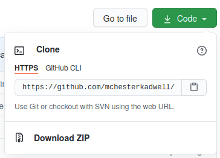
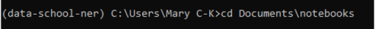

# Introduction to Text-Mining with Python 2020

## Introduction

This repository contains Jupyter notebooks used for teaching *'Introduction to Text-Mining with Python'*, 
a course in the [Cambridge 
Digital Humanities](https://www.cdh.cam.ac.uk) (CDH) Learning programme 2020. This course is the first CDH 
course to be delivered completely online following the coronavirus outbreak and various modifications were 
made from last year's course to facilitate this.

The notebooks are designed to be worked on as self-paced materials in a 'flipped classroom' approach. They 
are also written as stand alone notebooks for anyone to follow and use as they wish.

### Content

The notebooks cover:

* Basic Python (strings, lists, list comprehensions, imports, functions, opening/reading/saving files)
* Steps in a text-mining pipeline for research
* Basic text-mining concepts (tokenising, normalising, cleaning, stopwords)
* Creating a frequency distribution and plotting the results
 
## Code Details

The notebooks should run on the following versions of Python:

The aim of the code in this repository is to show basic text-mining techniques 
to participants who are complete beginners to both text-mining and coding. 
As such, the notebooks are designed to be run as a teaching aid, not as a 
serious text analysis tool.

## Quick Start: Launch Notebooks Online

The easiest way to run the Jupyter notebooks in this repository is to click on the Binder button above. This will 
open in the same tab. To open in a new tab, right-click the button and choose 'Open in a new tab' or similar, 
depending on your browser. Binder will launch a virtual environment in your browser where you can open and run the 
notebooks without installing anything. 

Please note:

* Binder will shut down after about 10 minutes of inactivity i.e. if you don't interact with the notebooks for a while, 
such as running cells or opening files. You can simply open a new Binder to start again.
* Binder will not save any changes you make to the notebooks. To save changes you need to download the notebooks and 
run them on your own computer.

## Running Notebooks on Your Own Computer (Beginners)

These instructions are suitable if you have never installed Jupyter Notebooks 
or Python on your own computer before.

### Install Jupyter Notebooks and Python with Anaconda 

[Install Anaconda (Python 3.7)](https://www.anaconda.com/distribution/#download-section). 

Pick the version appropriate for your operating system (Windows, Mac, Linux). 
Make sure you choose ‘Python 3.7’ (not ‘Python 2.7’). 

Once it has installed, [open Anaconda Navigator](http://docs.anaconda.com/anaconda/user-guide/getting-started/#open-navigator).

### Download the Notebooks from GitHub 

Go to the [GitHub page](https://github.com/mchesterkadwell/intro-to-text-mining-with-python ) 
where this code repository is kept. For a simple download, click the ‘Clone or 
download’ green button, then pick 'Download ZIP'.

Open the ZIP file that is downloaded. In most operating systems this will 
 automatically unzip it back into individual files. Move the folder to 
 somewhere you want to keep it, such as 'My Documents'. 

(The more advanced method is to use `git` to clone the repository, but we won’t 
cover that here.)

### Run Notebooks in a Dedicated Environment 

In simple terms, an environment is like an isolated box in which to run a 
notebook safe from interference by other notebooks. Anaconda provides one 
default environment, called ‘root’, in which to get up and running quickly. 
However, you should really make a new environment for each project (which may 
have one or more related notebooks).

In **Anaconda Navigator > Environments** click on the ‘Create’ button in the 
bottom of the Environments list. 

Type a name e.g. 'intro-to-text-mining', make sure that 'Python' is _checked_ 
and under the dropdown pick '3.7'. Make sure that 'R' is left _unchecked_. 

Then click the ‘Create’ button. 

It will take a few seconds to set up...

Then in **Anaconda Navigator > Environments** make sure you have selected your 
new environment. 

On the right of the environment name is a small green play arrow. Click on it and pick ‘Open Terminal’ from the 
dropdown.

In the Terminal that opens type the following, and press return:

`conda install pip`

If you do not already have pip installed, it will install it. Otherwise it will give a message:

`# All requested packages already installed.`

Then change directory to wherever you saved the notebooks folder by typing something like:

`cd \path\to\notebooks`

where `path\to\notebooks` is the filepath to wherever you’ve put the notebooks folder.

If you are on a **Mac**, make sure to use forward slashes in the filepath instead e.g. `path/to/notebooks`

Then install all the dependencies by typing:

`pip install -r requirements.txt`

This should initiate a big list of downloads and will take a while to finish. Please be patient.

Finally, to launch the Jupyter notebook server type:

`jupyter notebook`

This opens a web page at **http://localhost:8888/tree** showing the project:

If not, you can copy and paste one of the URLs in the Terminal window into your browser e.g. 
http://localhost:8888/?token=ddb27d2a1a6cb29a3483c24d6ff9f7263eb9676f02d71075
(This one will not work on your machine, as the token is unique every time.)

When you are finished with the notebook, press **ctrl+c** to stop the notebook server. 

You can close the Terminal window.

### Starting the Notebook Server Again

Next time you want to start the notebook server:

In **Anaconda Navigator > Environments** make sure you have selected your new environment. 

On the right of the environment name is a small green play arrow. Click on it and pick ‘Open Terminal’ from the 
dropdown.
 To launch the Jupyter notebook server type:

`jupyter notebook`

When you are finished with the notebook, press **ctrl+c** to stop the notebook server. You can close the Terminal window.

